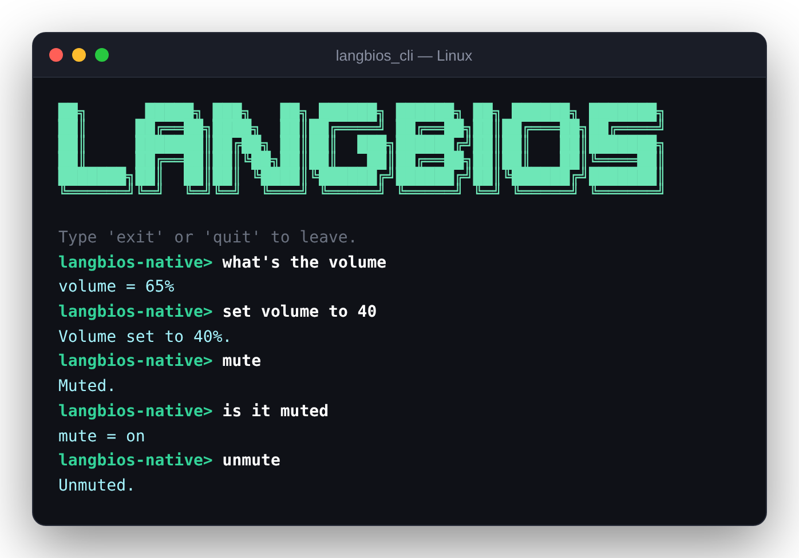
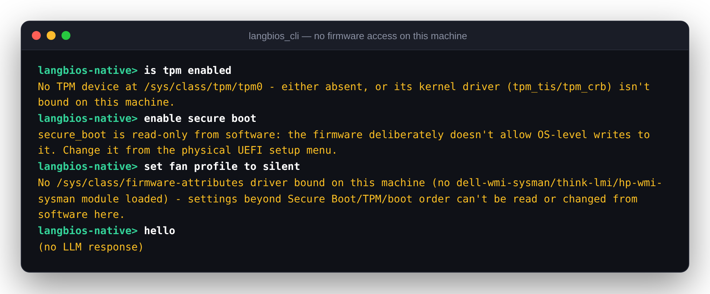
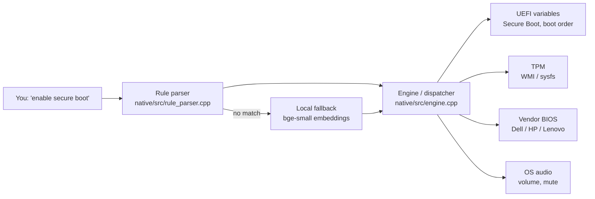

<div align="center">

# LangBIOS

**Talk to your computer's BIOS/UEFI settings in plain English.**
A real hardware backend, not a simulation.

[](#building-the-native-layer)
[](langbios/)
[](native/)
[](https://github.com/LAKSHYAJAIN16/LangBIOS)
[](https://github.com/LAKSHYAJAIN16/LangBIOS/issues/new)



</div>

```text
langbios> enable secure boot
langbios> what's my fan profile
langbios> crank up the fans
langbios> set boot order to 0001, 0000
langbios> list settings
```

## Why LangBIOS

- **It's real.** Every command goes through the actual OS firmware APIs (UEFI variables, WMI, `efivarfs`, `/sys/class/firmware-attributes`). There is no mock mode.
- **It understands you.** A fast rule-based parser handles common phrasing. Anything it misses goes to a small bundled model that runs offline, so `"crank up the fans"` still resolves to `fan_profile=performance`.
- **It can't make things up.** The fallback model only ever picks one of a fixed set of known intents, never free text. That means it can't invent a setting or a value.
- **It's honest.** If your hardware can't do something, it says exactly why instead of pretending it worked:

<p align="center">
  
</p>

## Contents

- [Quick start](#quick-start-windows)
- [What you can say](#what-you-can-say)
- [How it's built](#how-its-built)
- [How real BIOS access actually works](#how-real-bios-access-actually-works)
- [How the local fallback works](#how-the-local-fallback-works)
- [What's really possible on your hardware](#whats-really-possible-depending-on-your-hardware)
- [Building the native layer](#building-the-native-layer)
- [Elevation / permissions](#elevation--permissions) · [Safety notes](#safety-notes) · [Verified against real hardware](#verified-against-real-hardware)
- [Docs site](#docs-site) · [Tests](#tests)

## Quick start (Windows)

Build and run the installer (`installer/LangBIOS.iss`, requires [Inno Setup](https://jrsoftware.org/isinfo.php)):

```powershell
powershell -ExecutionPolicy Bypass -File native/fetch-llm.ps1   # bundled local NL fallback, ~76MB, optional but recommended
powershell -ExecutionPolicy Bypass -File native/build.ps1
& "<Inno Setup install dir>\ISCC.exe" installer\LangBIOS.iss
installer\dist\LangBIOS-Setup.exe
```

That installs `langbios.exe` to `%LOCALAPPDATA%\Programs\LangBIOS` and adds it to your PATH (no admin needed to install). Open a **new** terminal and run:

```powershell
langbios "list settings"
langbios                          # interactive REPL
```

This path doesn't need Python, an API key or Ollama. If the rule parser doesn't recognize your phrasing, a small bundled semantic-matching model handles it (see [How the local fallback works](#how-the-local-fallback-works)). It runs fully offline and adds only ~46MB to the installer.

## Quick start (from source, any platform)

```bash
git clone https://github.com/LAKSHYAJAIN16/LangBIOS.git
cd LangBIOS

./native/build.sh                 # Linux; see "Building the native layer" for Windows/macOS
python -m langbios.cli "list settings"
python -m langbios.cli            # interactive REPL
```

The Python CLI can also fall back to an optional local LLM for open-ended phrasing: install [Ollama](https://ollama.com), then run `ollama pull llama3.2` and `ollama serve`. Pass `--no-llm` to turn it off.

## What you can say

| You type | What happens |
|---|---|
| `list settings` | Reads every setting this machine exposes |
| `is secure boot on` · `what's my fan profile` · `check turbo` | Reads one setting (questions are always reads, even if they contain "on"/"enabled") |
| `enable virtualization` · `turn off fast boot` | Toggles a vendor BIOS setting |
| `set fan profile to silent` · `power mode balanced` | Sets an enum setting |
| `set boot order to 0001, 0000` | Rewrites the real UEFI `BootOrder` (must list every entry) |
| `set volume to 40` · `mute` · `unmute` · `is it muted` | Controls system audio, no elevation needed |
| `crank up the fans` · `make the fans quiet` | Phrasing the rule parser misses, resolved by meaning via the local fallback |
| `reset to factory defaults` | Always refused with an explanation: a factory reset is only possible from the UEFI setup menu |

## How it's built



- **`native/` (C++)** is the real engine: a rule-based parser, a dispatcher that routes each setting to the right backend, platform-specific firmware access (`native/src/windows/`, `native/src/linux/`, `native/src/macos/`), and a bundled local semantic-matching fallback (`native/src/llm_fallback.cpp`) for phrasing the rule parser misses. It compiles to `langbios_native.{dll,so,dylib}`, which Python loads, and a standalone `langbios_cli` binary.
- **`langbios/` (Python)**: `native_backend.py` is a `ctypes` bridge into the compiled library. `llm_parser.py` adds an *optional* extra local-LLM fallback (via Ollama) for open-ended phrasing a fixed intent set can't cover. `cli.py` ties it together into a REPL.

This talks to **real firmware**. Reads are safe everywhere; writes change real NVRAM and need elevation (see below). Check the [capability table](#whats-really-possible-depending-on-your-hardware) for what your hardware supports before running a `set`/`enable`/`disable` command.

## How real BIOS access actually works

You can't "just write C" that talks to firmware directly: every modern OS blocks user-mode code from touching hardware or NVRAM. Every real operation here goes through the same chain:

1. **Compiled native code** (`native/build/langbios_native.{dll,so}`) calls a specific, privileged **OS API**: `GetFirmwareEnvironmentVariableW`/WMI on Windows, or a read/write on `efivarfs` or `/sys/class/firmware-attributes` on Linux.
2. That call traps into the **kernel**, the only thing allowed to talk to firmware directly.
3. For **boot order / Secure Boot**, which the UEFI spec standardizes (so this part works the same way on both OSes), the kernel forwards the request to the **UEFI runtime services** the firmware itself exposes at boot.
4. For **vendor settings** (Dell/HP/Lenovo), the OEM ships a **kernel-mode driver** that triggers an **SMI (System Management Interrupt)**. That's a hardware trap that pauses the OS and runs firmware code in a special CPU mode (SMM) to touch NVRAM. This only exists where the OEM built it, and no software can get around that.

Python never does this directly. `langbios/native_backend.py` is a `ctypes` bridge into the compiled native library, which makes the privileged calls.

## How the local fallback works

This is still a real small language model doing real neural inference, not string matching. `bge-small-en-v1.5` is a 33M-parameter transformer, and it understands phrasing that was never in its examples: `"crank up the fans"` resolves to `fan_profile=performance` by meaning, not by keyword overlap.

What's different is the kind of model. Mapping one sentence onto one of a few dozen known settings/actions is a **classification** problem, not open-ended text generation. A generative LLM needs a large, vocabulary-sized output layer just to be able to write text at all. So the fallback uses an **encoder** model instead: it turns text into a vector capturing its meaning, and the nearest known example wins by cosine similarity:

1. `native/data/canonical_intents.json` has ~106 curated example phrases covering every setting/action (e.g. `"crank up the fans"` → `set fan_profile=performance`).
2. `native/embed-intents.ps1` embeds all of them **once, offline**, using the bundled model. It writes the vectors to `native/data/canonical_embeddings.bin`, which is ~161KB and committed to git (unlike the model itself, it's small enough).
3. At runtime, `native/src/llm_fallback.cpp` starts `llama-server` in `--embedding` mode (bundled, ~76MB total with `bge-small-en-v1.5`), embeds only the user's input, and compares it against the precomputed vectors. If the best similarity is below the threshold (0.75, tuned against real measured scores; see `llm_fallback.cpp`), it reports `(no LLM response)` instead of guessing.

This is deterministic, and it can't hallucinate an invalid setting the way a generative model could: it can only ever return one of the known canonical intents. It's also ~90% smaller than the 490MB generative model (Qwen2.5-0.5B-Instruct) this project originally shipped with, and measurably *more* reliable on this project's own test phrases (see `native/fetch-llm.ps1` for the head-to-head notes).

## What's really possible, depending on your hardware

| Setting | Mechanism | Writable from software? | Works on |
|---|---|---|---|
| `boot_order` | Standard UEFI variables (`BootOrder`/`Boot####`) | **Yes** | Any UEFI machine (elevated). macOS: single default startup disk via `bless`, Intel only |
| `secure_boot` | Standard UEFI variable | No. The firmware blocks this by design (authenticated-variable protection) | Any UEFI machine (elevated, read-only). Not accessible from software at all on macOS |
| `tpm` | WMI (`Win32_Tpm`) / sysfs (`/sys/class/tpm`) | No. It isn't an OS-writable setting anywhere | Any machine with a TPM (elevated). Doesn't exist on macOS (Secure Enclave instead) |
| `virtualization`, `fan_profile`, `power_profile`, `cpu_turbo`, `fast_boot`, `xmp` | Vendor WMI classes (Windows) / `/sys/class/firmware-attributes` (Linux) | Yes, **only if** the vendor stack is present | Dell / HP / Lenovo (Windows: their own WMI driver; Linux: `dell-wmi-sysman`/`think-lmi`/`hp-wmi` kernel module). No vendor interface exists on macOS at all |
| `volume`, `mute` | Real OS audio API: Core Audio (Windows), `pactl`/PulseAudio (Linux), `osascript` (macOS) | **Yes**, on all three platforms | Any machine with a default audio output device. No elevation needed |

On machines without a vendor stack (most DIY desktops, and this project's own dev machine, a Microsoft Surface), LangBIOS reports "no vendor BIOS management interface available" for BIOS-specific settings instead of pretending to succeed.

`volume`/`mute` are the first settings beyond firmware that this project supports. They're real OS-level hardware control, not BIOS settings at all. They were added because the mechanism (a documented OS audio API) is available on all three platforms, which isn't true of most BIOS vendor attributes.

## Building the native layer

### Windows

Requires a C++20 compiler (clang++/LLVM or MSVC) with the Windows SDK.

```powershell
powershell -ExecutionPolicy Bypass -File native/build.ps1
```

Produces `native/build/langbios_native.dll` and `native/build/langbios_cli.exe`. The DLL is cross-compiled to match your **system Python's architecture**, because ctypes requires an exact match (edit the `--target` flag in `build.ps1` if yours isn't x86_64). The standalone CLI targets your host architecture directly.

### Linux

Requires g++ or clang++ with C++20 support.

```bash
./native/fetch-llm.sh   # bundled local NL fallback, optional but recommended
./native/build.sh
```

Produces `native/build/langbios_native.so` and `native/build/langbios_cli`.

> **Honesty note:** the Linux backend (`native/src/linux/`) was written against the documented kernel ABIs (`efivarfs`, `/sys/class/firmware-attributes`, `/sys/class/tpm`). It has been built on Linux (g++ 13, clang++) and run there: `volume`/`mute` were verified end-to-end against a real PulseAudio server, the Python `ctypes` bridge loads the `.so` correctly, and the firmware paths correctly report "not available" when there's no `efivarfs`/TPM/vendor driver. What has **not** been verified is the firmware paths against real UEFI hardware on Linux. The Windows backend *has* been (see below). Test the Linux firmware write path carefully before trusting it, ideally starting with read-only commands. `fetch-llm.sh`'s bundled-file list is also inferred rather than traced with `ldd` (see its header comment), so it's worth double-checking if you have real Linux hardware.

### macOS

Requires Xcode Command Line Tools (`clang++`).

```bash
./native/fetch-llm.sh   # bundled local NL fallback, optional but recommended
./native/build-macos.sh
```

Produces `native/build/langbios_native.dylib` and `native/build/langbios_cli`.

> **Honesty note:** as with Linux, the macOS backend was written against documented Apple tools (`bless`, `diskutil`, `osascript`) but hasn't been run on real Mac hardware. It's also deliberately thinner than Windows/Linux. Apple publishes no vendor BIOS interface at all, there's no TPM (Secure Enclave instead), Secure Boot can't be reached from a running OS by design, and boot disk selection only works on Intel Macs. See `native/src/macos/*.cpp` for why each of those is a real platform limitation, not a gap in this code.

## Elevation / permissions

Real firmware access needs elevated privileges on every OS, by design:

- **Windows**: needs `SeSystemEnvironmentPrivilege`, which is only ever granted to Administrators and must also be enabled in-process. Run from an elevated terminal, or enable `sudo` under Settings → Privacy & Security → For developers.
- **Linux**: root / `CAP_SYS_ADMIN`. Run with `sudo`.
- **macOS**: root for the boot-disk write path (`bless`); reads generally don't need it.

Non-elevated runs still work. They report exactly *why* an operation needs elevation rather than failing silently.

`volume`/`mute` are the exception: OS audio APIs are deliberately unprivileged (any logged-in user can control system volume), so those work without elevation on all three platforms.

## Safety notes

- **Boot order writes refuse partial reorders.** You must list every current boot entry, in order, so a typo can never silently drop a boot device from the real `BootOrder` variable.
- **Secure Boot and TPM are always read-only** from every code path. The firmware itself enforces this; no version of this tool can bypass it, nor should it.
- **Questions never write.** Anything phrased as a question (`is secure boot on`, `is my fan profile silent`) is always a read, even if it contains a setting value.
- **Vendor attribute writes** (Dell/HP/Lenovo) may only take effect after a reboot or a pending-changes commit, and can fail if a BIOS admin password is set. Both cases are reported explicitly rather than assumed to have worked.

## Verified against real hardware

On this project's own dev machine (Microsoft Surface, Snapdragon/ARM64, no vendor BIOS management stack):

- Real elevated read + write round-trip of the actual `BootOrder` UEFI variable (read current order, write the same order back, read again to confirm), persisted to firmware via `SetFirmwareEnvironmentVariableExW`.
- Real elevated read of Secure Boot state and WMI-based TPM query.
- Correct, honest non-elevated error messages (privilege/access-denied) when not run as Administrator.
- Correct "no vendor BIOS interface available" report, since this hardware has none.

On Linux (x86_64, g++ 13 and clang++): native build, Python `ctypes` bridge, and `volume`/`mute` end-to-end against a PulseAudio sink. The screenshots at the top of this README are real output from that run.

## Docs site

`docs-site/` is a small Next.js site with install, build and usage docs. Run it with `npm install && npm run dev` inside `docs-site/`.

<p align="center">
  
</p>

## Tests

Tests live on the `tests` branch, not `main`. Check them out separately:

```bash
git checkout tests -- tests/ requirements-dev.txt
pip install -r requirements-dev.txt
python -m pytest
```

## Contributing

Bug reports are especially welcome from anyone with **real Linux or macOS hardware**, since those firmware paths haven't been verified on real machines yet. [Open an issue](https://github.com/LAKSHYAJAIN16/LangBIOS/issues/new) with your OS, hardware vendor, and the exact command and output.

Forking? See [docs/badges.md](docs/badges.md) for extra README badges you can drop in.
