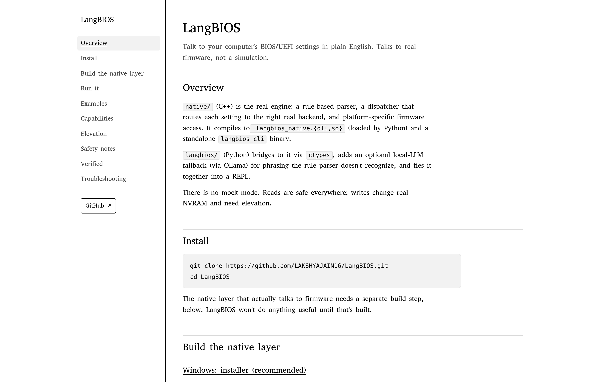

# LangBIOS docs site

The documentation site for [LangBIOS](../README.md): install, build, usage examples, capabilities and troubleshooting, on a single page (`app/page.js`) with a sidebar (`app/Sidebar.js`).

Built with Next.js (App Router).

```bash
npm install
npm run dev      # http://localhost:3000
npm run build    # production build
npm run lint
```


